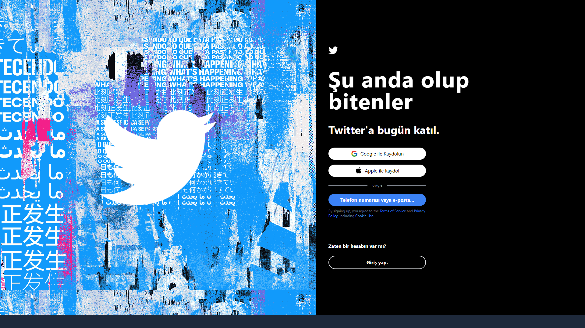
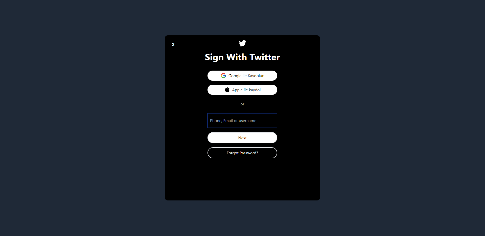
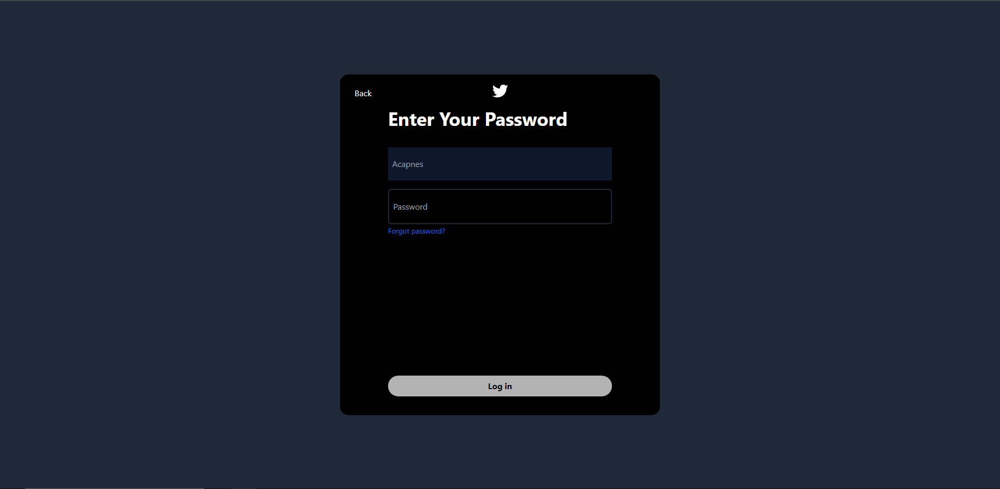
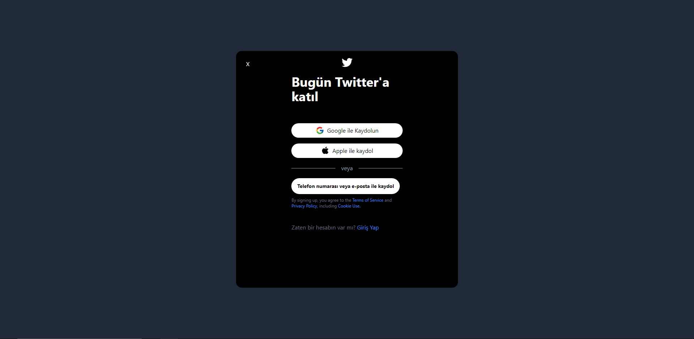
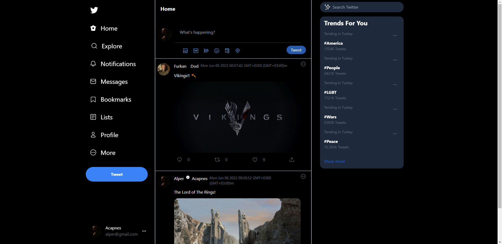

# Project - Twitter Clone

Welcome to the Twitter Clone project! This venture stands as a testament to my journey in web development during my student years. Through this project, I aimed to create a dynamic and engaging platform while enhancing my skills in both frontend and backend development.

## Technologies Used

- **Frontend**: Crafted using React with TypeScript (React TSX) and enhanced with Tailwind CSS
- **Backend**: Engineered with NestJS framework and RESTful API endpoints
- **Microservices**: Employed for scalability and modularity
- **Authentication**: Implemented an Auth module for user sign-in and sign-up functionalities

## The Power of NestJS and Microservices

### NestJS for Backend Excellence
NestJS, with its modular architecture and robust dependency injection system, was the perfect choice for creating the backend. The framework's compatibility with TypeScript enabled me to build a structured and maintainable codebase, offering a solid foundation for RESTful API development.

### Embracing Microservices
To ensure scalability and independence, I adopted the microservices architecture. This decision allowed me to design each service as a separate entity, promoting modularity and enhancing performance. With NestJS's built-in support for microservices, I seamlessly orchestrated various components to work harmoniously.

## Tailwind CSS for Enhanced Styling

### UI/UX Design Philosophy
Tailwind CSS played a pivotal role in achieving a sleek and responsive UI/UX design. Its utility-first approach allowed me to rapidly style components and layouts, creating a consistent and visually appealing user experience.

## Authentication Infrastructure

### Secure User Management
The authentication infrastructure was a critical part of the project. I integrated user authentication using NestJS's authentication guards and strategies, ensuring secure user management and seamless access control to various features.

### Login Screens

### Register Screens

### Feed

## A Journey of Self-Improvement

Beyond the technical aspects, this project serves as a testament to my growth and self-improvement. It reflects my commitment to exploring new technologies, overcoming challenges, and transforming them into valuable learning experiences. This Twitter Clone represents not only the culmination of my dedication to web development but also the gateway to further endeavors.

I invite you to delve into this project, witness the synergy between NestJS, microservices, and Tailwind CSS, and experience firsthand the fusion of technical proficiency and creative design.

Thank you for joining me on this enriching journey!
