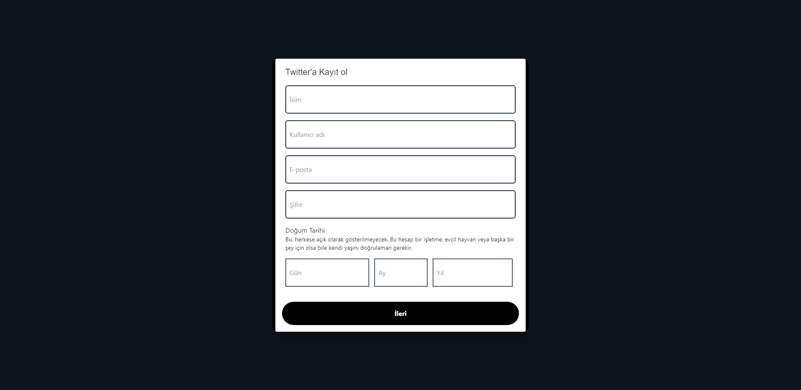

# Twitter-Clone

Full-Stack Development by Acapnes.

## Auth Screen

Same as Twitter's Authorizon screen.

## Login Screens

On the first page, the user is asked for name or e-mail information. Then second page, asked for password information and the login process is performed.

## Register Screens

# Home Screen

There are 3 comps here. Left Navbar, middle Feed, right Widgets.

